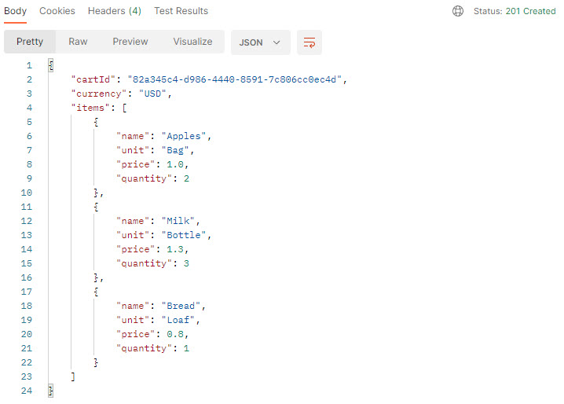
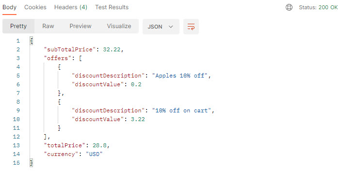
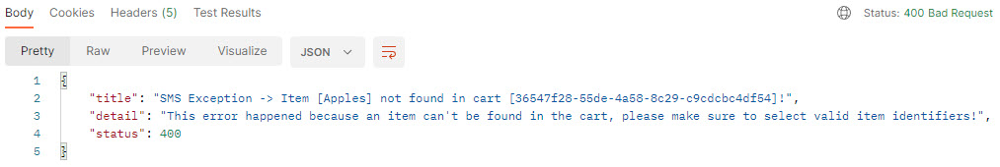

# Java Demo Project

This project is intended to showcase my software engineering and development skills.

It is a demo project but incorporates **key software design and clean code principles.**

## 1. Features

This project represents a backend module of a basic Store Management System (SMS), it provides APIs to:
- Create cart with/without items.
- Get cart details.
- Add/remove items to/from cart. 
- Checkout cart (inc. processing applicable discount offers).

Items examples:
- *Bread - 1.20€ per Packet*
- *Milk - 0.85€ per Bottle*
- *Tuna - 1.65€ per Tin*

Offers examples:
- *15% discount on Bread this week*
- *Buy 2 bottles of Milk and get 50% discount on Bread*
- *20% direct discount on cart*

## 2. Demonstrated Skills

### 2.1. Design Patterns

| Applied Design Pattern | Use Case                                                                    | Example                                                                                                |
|------------------------|-----------------------------------------------------------------------------|--------------------------------------------------------------------------------------------------------|
| Strategy               | Define condition/execution strategies for different types of offers         | [Discount Strategies](sms-core/src/main/java/com/sinan/javademo/smscore/model/offer/strategy/discount) |
| Builder/Director       | Build cart objects                                                          | [Cart Builder](sms-core/src/main/java/com/sinan/javademo/smscore/model/cart)                           |
| Factory Method         | Create repositories based on config properties                              | [Items Repository](sms-core/src/main/java/com/sinan/javademo/smscore/repository/items)                 |
| Adapter                | Serialize/deserialize APIs response to custom json                          | [Response Adapters](api-gateway/src/main/java/com/sinan/javademo/apiapplication/adapter)               |
| Singleton              | Maintain unique instance of several models (using CDI `@ApplicationScoped`) | [Cart/Offer Services](sms-core/src/main/java/com/sinan/javademo/smscore/service)                       |

### 2.2. Dependency Injection (DI)
- Code maintains dependency on abstraction rather than concrete objects (Inversion of Control).
- DI framework: [Jakarta Context Dependency Injection (CDI)](https://jakarta.ee/specifications/cdi/).

### 2.3. Clean Code Principles
- KISS: code is written as SIMPLE as possible.
- DRY: code relies on re-usability and abstraction to prevent duplication.
- YAGNI: no unnecessary functionalities are implemented (except for some cases for the sake of this demo).
- Readability: descriptive & self-explanatory classes, methods, and variable names.
- Convention: code follows consistent and standard naming conventions.

### 2.4. Code Documentation
- Code is self-explanatory. 
- Code is documented in [javadoc](https://docs.oracle.com/javase/8/docs/technotes/tools/windows/javadoc.html) format. 
- Clarification comments are added when necessary. 
- Nothing is commented out!

### 2.5. Automated Testing
- Extensive test cases for happy path and edge cases.
- Unit tests organized in [AAA - Arrange, Act, Assert](https://java-design-patterns.com/patterns/arrange-act-assert/) pattern.
- Testing framework: [TestNG](https://testng.org/doc/)
- Mocking library: [Mockito](https://site.mockito.org)


### 2.6. OOP & OOD Principles
- Code is fully OOP (thanks to Java!).
- Abstraction: code relies on abstraction to handle complexity (DI, design patterns, ...).
- Encapsulation: code implements restricted access to data members and methods (with getters/setters when required). 
- Inheritance: classes are structured in hierarchical manner.
- Polymorphism: ex. via strategy design pattern.
  
### 2.7. Additional Features
- API contracts use custom deserializers to isolate api response from internal data fields (see [Contracts](api-gateway/src/main/java/com/sinan/javademo/apiapplication/contract) and [Adapters](api-gateway/src/main/java/com/sinan/javademo/apiapplication/adapter)).
- API errors follow IETF [RFC 7807](https://datatracker.ietf.org/doc/html/rfc7807) standard (see [APIErrorResponseJsonAdapter.java](api-gateway/src/main/java/com/sinan/javademo/apiapplication/adapter/APIErrorResponseJsonAdapter.java)).

## 3. Deployment

To deploy the project on your device, clone it and run the following:
#### Maven -> Build
*To compile java files and create executable war/jar packages:* 
```
mvn clean package
```

#### Docker -> Create network
*To create docker network (first time only):*
```
docker network create smsjavademo_net
```

#### Docker -> Run
*To build docker image and start container:*
```
docker-compose up --build
```


## 4. API Reference

#### Ping

```http
  GET /sms/api/engineering/ping
```

#### Create Cart

```http
  POST /sms/api/cart
```
- Body - raw (json): `[... "itemIdentifier" ...]`

#### Cart Details

```http
  GET /sms/api/cart/{cartId}
```

#### Add Item

```http
  POST /sms/api/cart/{cartId}/items
```
| Parameter        | Type     | Description                    |
|:-----------------|:---------|:-------------------------------|
| `itemIdentifier` | `String` | **Required**. Item to be added |

#### Remove Item

```http
  DELETE /sms/api/cart/{cartId}/items/{itemIdentifier}
```

#### Cart Checkout

```http
  GET /sms/api/cart/{cartId}/checkout
```

## 5. Screenshots
Here are some examples of APIs response: 
#### Cart Details Response


#### Cart Checkout Response


#### API Error Response



